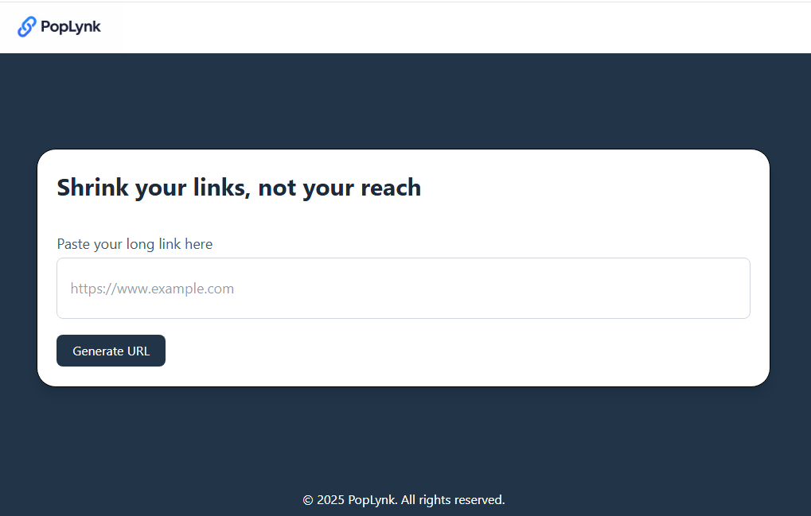

# PopLynk

PopLynk is a simple and fast URL shortener built with **React** (frontend) and **Node.js + Express** (backend).  
It allows anyone to create short URLs without signing up.

## Features
- Generate short URLs instantly
- Copy shortened URLs to clipboard
- Redirect seamlessly to original links
- Public usage — no login required
- Lightweight and responsive UI

## Tech Stack
**Frontend:**
- React
- Tailwind CSS

**Backend:**
- Node.js
- Express
- MongoDB (Mongoose)

## Installation

### 1️⃣ Clone the Repository
```bash
git clone https://github.com/yourusername/poplynk.git
cd poplynk
```

### 2️⃣ Backend Setup
```bash
cd backend
npm install
```
Create a .env file in the backend folder and add:

```ini
MONGO_URL=your_mongodb_connection_string
BACKEND_URL="http://localhost:3000"
FRONTEND_URL=your_frontend_url
PORT=3000
```

Run the backend:

```bash
npm run build
```
### 3️⃣ Frontend Setup
```bash
cd frontend
npm install
```
Run the frontend:

```bash
npm run dev
```
### Usage
Paste your long URL into the input field.

Click "Generate URL".

Copy and share your new PopLynk short URL.

### Folder Structure

```
poplynk/
  frontend/   → React frontend
  backend/    → Node.js backend
  ```
### Screenshots


### License
This project is open-source under the MIT License.